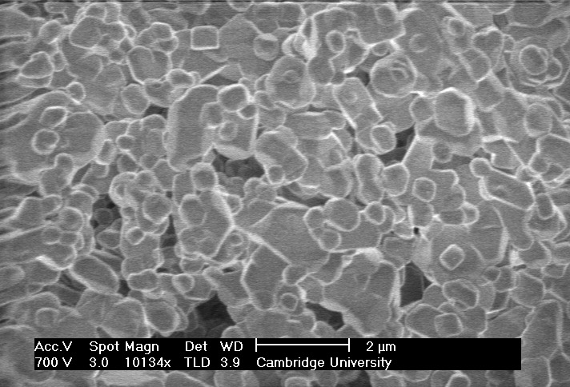
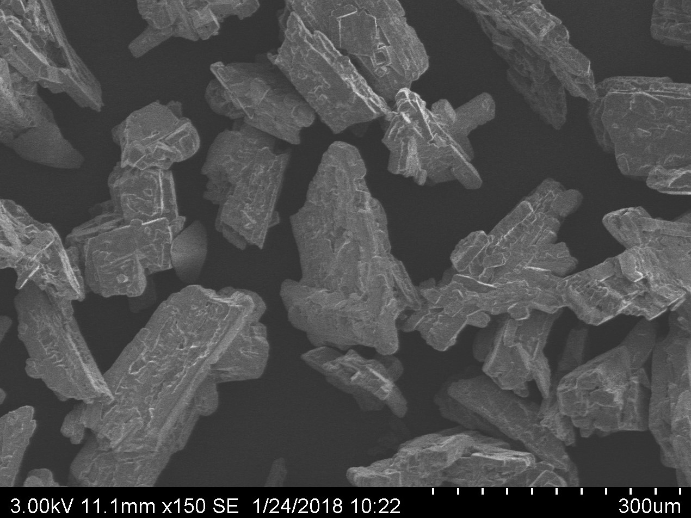
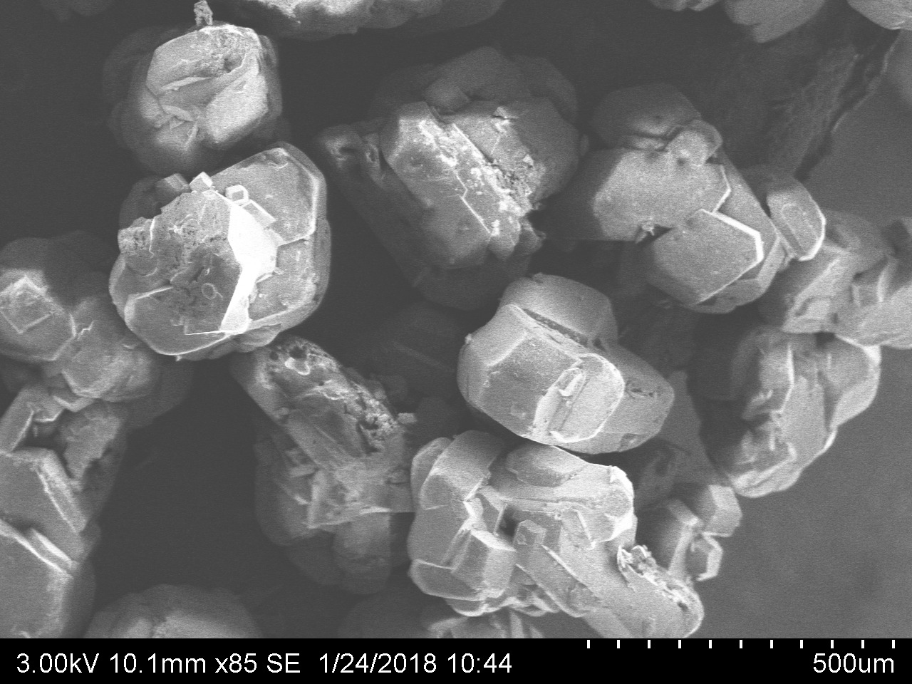
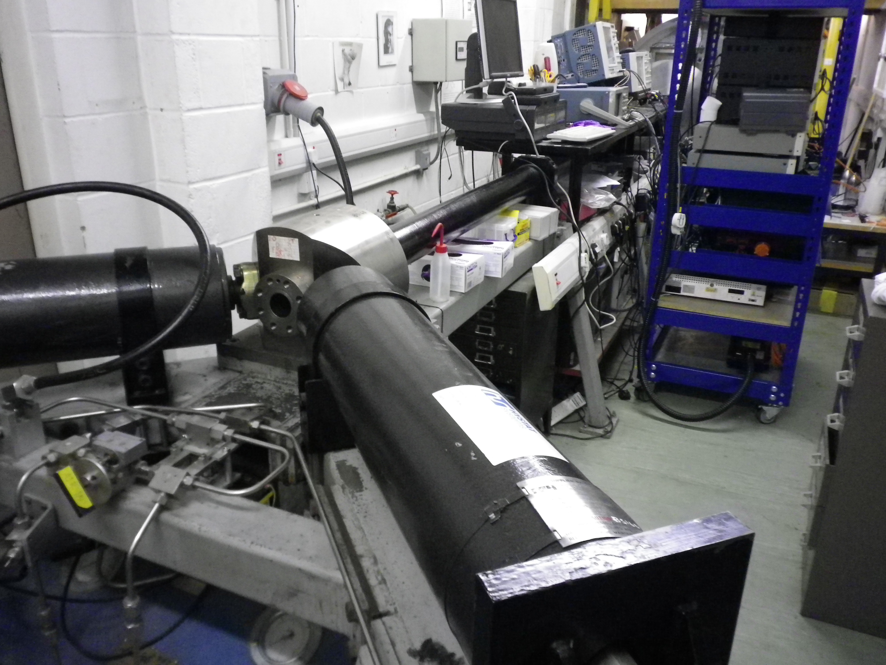
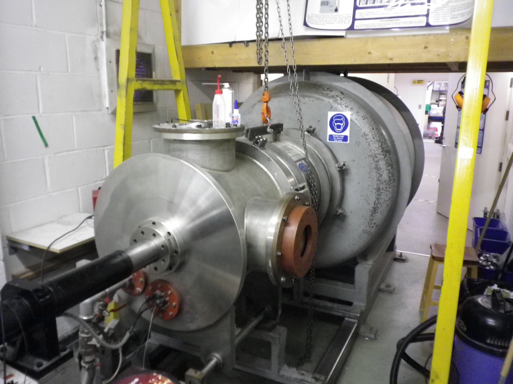
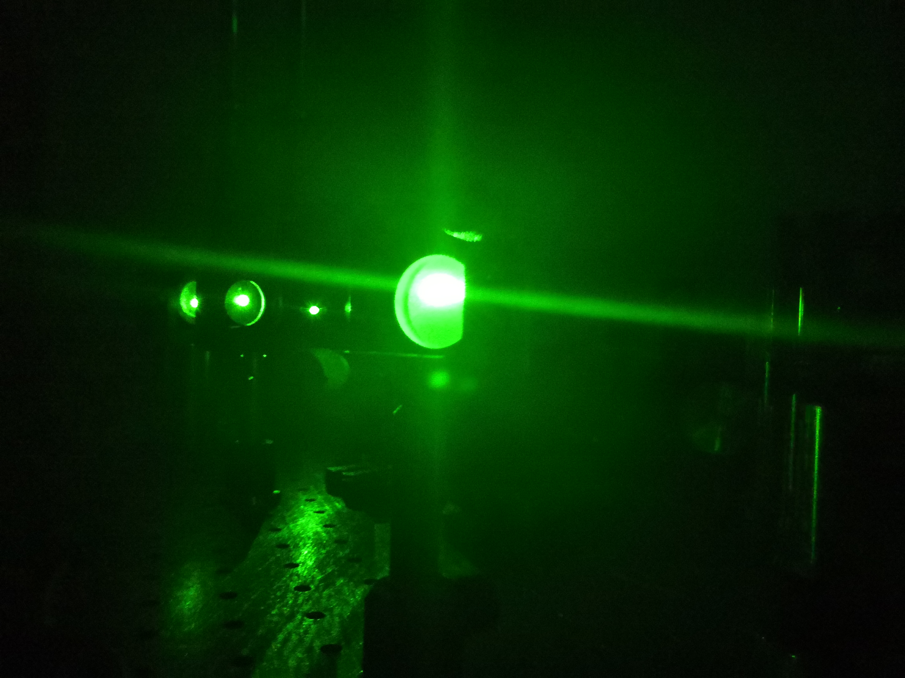
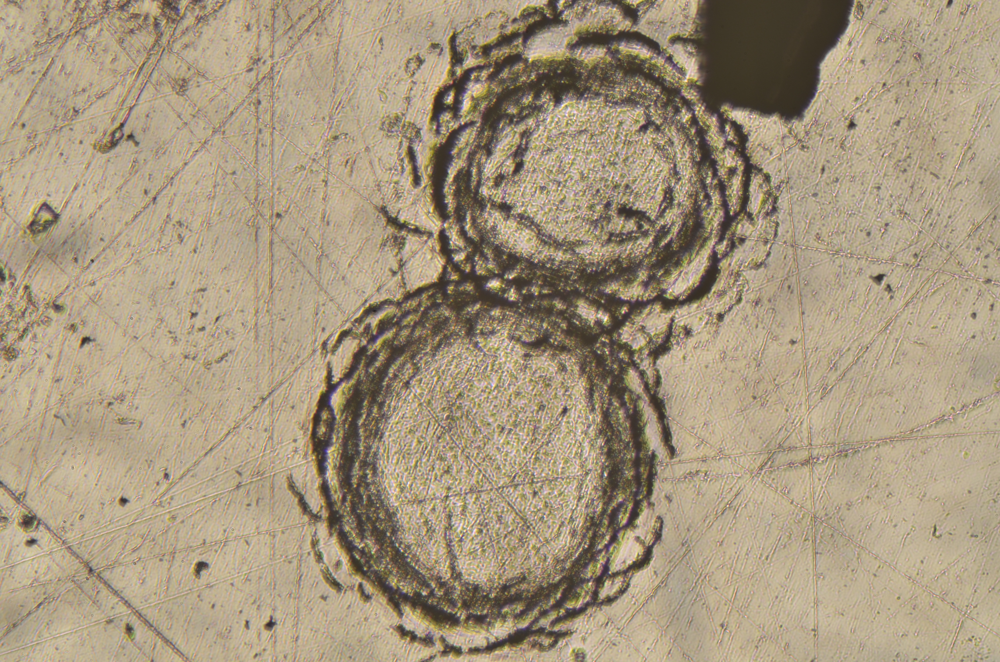

# PhD
The goal of my PhD was to use the secondary explosive pentaerythritol tetranitrate (PETN) as the subject of an investigation to characterise the effect of material properties on the reaction zone length and detonation wave curvature.

I studied in the [Surfaces, Microstructure and Fracture (SMF) Group (formerly and currently the Physics and Chemistry of Solids (PCS) group)](https://www.pcs.phy.cam.ac.uk/) and was supervised by Chris Braithwaite.

The work was funded by the [Atomic Weapons Establishment (AWE)](https://www.awe.co.uk/).

A list of my publications is [here](Publications)

---

Scanning Electron Microscopy of three different sizes of PETN

---

The Big Gun

---

Aligning the laser detonator

---

Impact holes created by a laser detonator

---